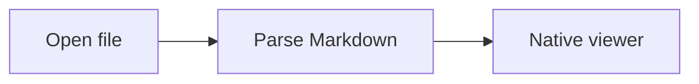
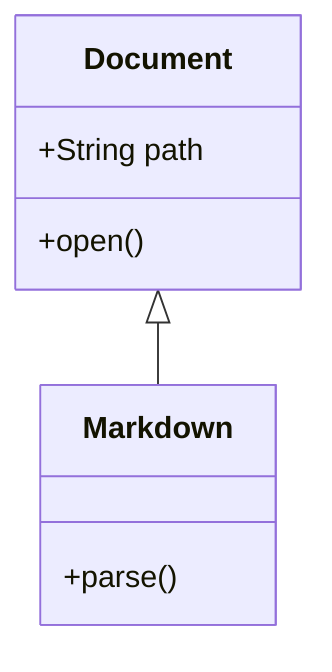
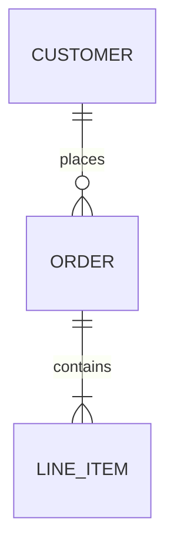
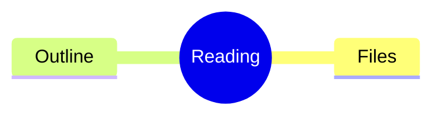
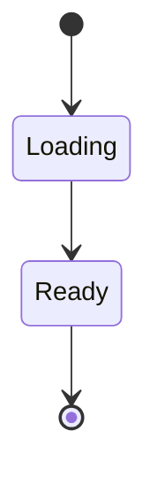

# Diagrams

## Flowchart

```mermaid
flowchart LR
    Open[Open file] --> Parse[Parse Markdown]
    Parse --> View[Native viewer]
```

## Class

```mermaid
classDiagram
    class Document {
      +String path
      +open()
    }
    class Markdown {
      +parse()
    }
    Document <|-- Markdown
```

## Entity relationship

```mermaid
erDiagram
    CUSTOMER ||--o{ ORDER : places
    ORDER ||--|{ LINE_ITEM : contains
```

## Mindmap

```mermaid
mindmap
  root((Reading))
    Files
    Outline
```

## State

```mermaid
stateDiagram-v2
    [*] --> Loading
    Loading --> Ready
    Ready --> [*]
```
